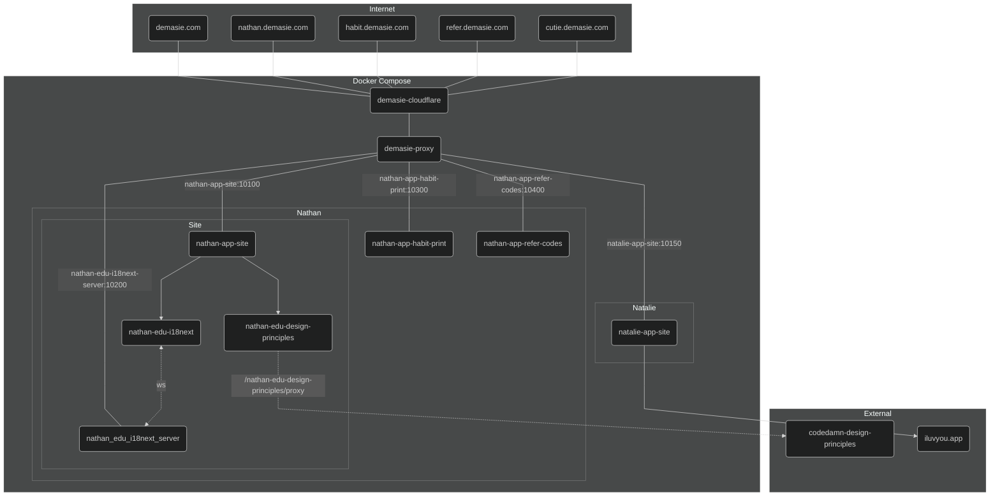

# [demasie.com](https://demasie.com)

 
 
 
 

 
 
 
 

<!--  -->

|          |                                                                             |
| -------- | --------------------------------------------------------------------------- |
| DevOps   |   |
| Backend  |                  |
| Frontend |   |

